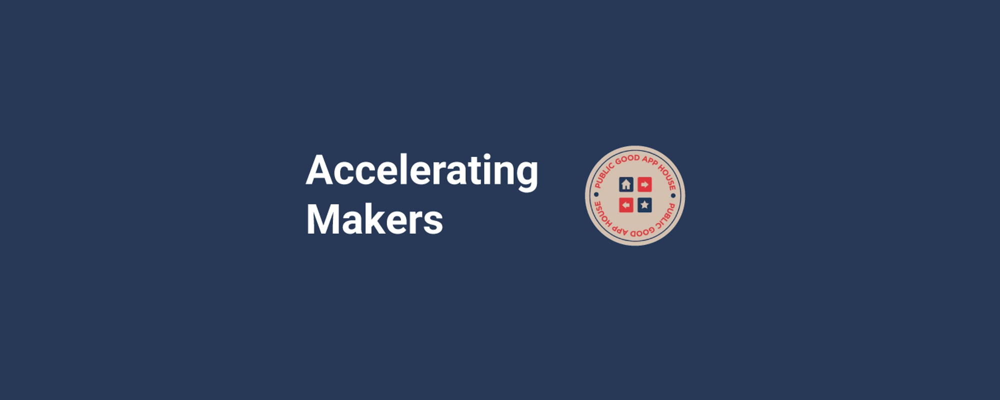

	

---

### DWeb for Impact: Solutions for Non-Profits and Educational Instittions

The following Awesome list of non-profit and educational institution Decentralized Web ([DWeb](https://wiki.mozilla.org/Dweb)) use cases, examples solutions, and tools was curated by [Accelerating Makers](https://acceleratingmakers.publicgoodapphouse.org/), a program of Public Good App House and [TechSoup](https://www.techsoup.org/) that is helping technology builders and nonprofits co-create purpose-built tools for public good.

	<a href="awesome.md">What is an awesome list?</a>&nbsp;&nbsp;&nbsp;
	<a href="contributing.md">Contribution guide</a>&nbsp;&nbsp;&nbsp;
	<a href="create-list.md">Creating a list</a>&nbsp;&nbsp;&nbsp;
	<a href="https://twitter.com/awesome__re">Twitter</a>&nbsp;&nbsp;&nbsp;

---

## Contents

- [Awesome List](readme.md)
- [Data Storage and Verification](#data-storage-and-verification)
- [Financial Transactions](#financial-transactions)

---

## Local Community Networks
- ### Distributed Press
	- [https://distributed.press/](https://distributed.press/) - Distributed Press is an open source publishing tool for the World Wide Web and DWeb. It automates publishing and hosting content to the WWW that it seeds to Hypercore and IPFS.
- ### Mapeo
	- [https://www.digital-democracy.org/mapeo](https://www.digital-democracy.org/mapeo) - Mapeo is a free digital toolset for documenting, monitoring, and mapping many types of data.
- ### NYC Mesh
	- [https://www.nycmesh.net/](https://www.nycmesh.net/) - We are a diverse group of volunteers dedicated to ending the digital divide and extending high-speed, reliable internet to all New Yorkers. You can help by joining our community network to get online, volunteering to connect neighbors or grow the network, and donating to improve our community infrastructure and ensure access for all.
- ### PeerTube (Fediverse)
	- [https://joinpeertube.org/en_US](https://joinpeertube.org/en_US) - An alternative to Big Tech's video platforms. PeerTube is a tool for sharing online videos developed by Framasoft, a french non-profit. With PeerTube, no more opaque algorithms or obscure moderation policies! PeerTube platforms you visit are built, managed and moderated by their owners.
- ### Proof of Humanity
	- [https://proofofhumanity.id](https://proofofhumanity.id) - Proof of Humanity, a system combining webs of trust, with reverse Turing tests, and dispute resolution to create a sybil-proof list of humans.
- ### Tor Project
	- [https://www.torproject.org/](https://www.torproject.org/) - We believe everyone should be able to explore the internet with privacy. We are the Tor Project, a 501(c)(3) US nonprofit. We advance human rights and defend your privacy online through free software and open networks. Defend yourself against tracking and surveillance. Circumvent censorship.
- ### United Nations World Food Programme Innovation Accelerator
	- [https://innovation.wfp.org/](https://innovation.wfp.org/) - Innovation is critical to enable the United Nations World Food Programme to deliver on its mandate to reach Zero Hunger. We put intention into innovation Our goal is to reach Zero Hunger. To achieve this, we pilot and scale promising ideas by leveraging advances in digital innovation. We also provide Innovation Consulting Services to share knowledge with other agencies and organizations working towards the Sustainable Development Goals.
